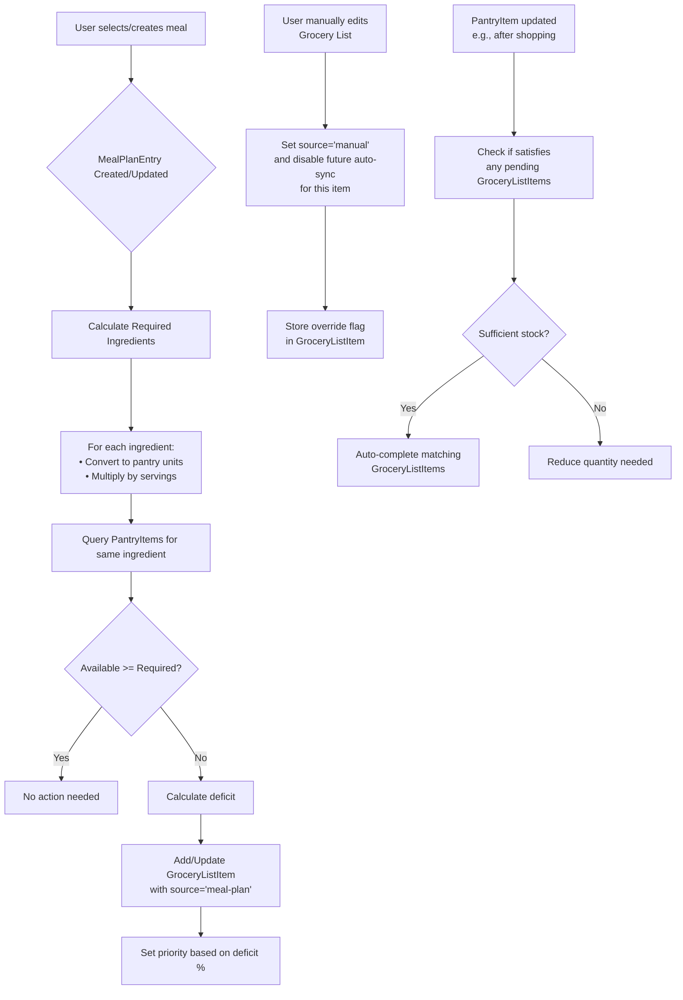

# Smart Integrated Meal Planning System: Technical Architecture & Feature Roadmap

## 1. System Architecture Overview

### Core Modules
- **Meal Planning Module**: Handles recipe selection, meal scheduling, and serving adjustments
- **Pantry Management Module**: Tracks inventory levels, expiration dates, and item locations
- **Grocery List Module**: Manages shopping needs with smart categorization and store optimization

### Architectural Principles
- **Event-Driven Synchronization**: Changes in any module trigger automated sync processes
- **Manual Override Priority**: User actions always supersede automated suggestions
- **AI-First Data Design**: All entities include metadata fields for future ML integration
- **Microservices Readiness**: Loose coupling via well-defined APIs/event contracts

## 2. Data Model & Entity Relationships

### Core Entities (with AI-ready fields)

#### `Ingredient` (Central Hub)
```typescript
{
  id: string;
  name: string; // normalized name (e.g., "all-purpose flour")
  category: Enum<'produce'|'dairy'|'meat'|'pantry'|...>;
  unit: Enum<'g'|'kg'|'ml'|'l'|'count'|'cup'|'tbsp'|...>;
  // AI/ML readiness fields
  embeddingVector?: number[]; // for semantic search/substitutions
  nutritionPerUnit: { // per base unit (g/ml/count)
    calories: number;
    protein: number;
    carbs: number;
    fat: number;
    fiber: number;
    sugar: number;
    sodium: number;
  };
  commonSubstitutes: string[]; // ingredient IDs
  seasonality: { peakMonths: number[] }; // 1-12
  storageTips: string;
  allergyTags: string[]; // ['gluten', 'nuts', ...]
  createdAt: Date;
  updatedAt: Date;
}
```

#### `PantryItem`
```typescript
{
  id: string;
  ingredientId: string; // FK to Ingredient
  userId: string;
  quantity: number;
  unit: string; // matches ingredient.unit
  location?: string; // 'fridge', 'pantry-shelf2', etc.
  expirationDate?: Date;
  purchaseDate: Date;
  pricePaid?: number;
  // AI readiness
  predictedExpiration?: Date; // ML forecast
  confidenceScore?: number; // 0-1 for prediction
}
```

#### `MealPlanEntry`
```typescript
{
  id: string;
  userId: string;
  recipeId: string; // FK to Recipe (see below)
  scheduledFor: Date; // start of meal period
  servings: number; // allows scaling
  notes?: string;
  // Sync tracking
  autoGenerated: boolean; // false = manual override
  lastSyncedAt: Date;
}
```

#### `Recipe` (simplified)
```typescript
{
  id: string;
  name: string;
  instructions: string[];
  // Ingredient requirements
  recipeIngredients: Array<{
    ingredientId: string;
    quantity: number;
    unit: string;
    notes?: string; // "finely chopped", "divided", etc.
  }>;
  // Metadata
  cuisineType: string[];
  dietaryTags: string[]; // ['vegetarian', 'gluten-free', ...]
  prepTimeMinutes: number;
  cookTimeMinutes: number;
  difficulty: Enum<'easy'|'medium'|'hard'>;
  // AI readiness
  flavorProfile: Record<string, number>; // sweet/salty/etc. scores
  pairingSuggestions: string[]; // recipe IDs
  imageUrl?: string;
}
```

#### `GroceryListItem`
```typescript
{
  id: string;
  userId: string;
  ingredientId: string; // FK to Ingredient
  quantityNeeded: number;
  unit: string;
  priority: Enum<'low'|'medium'|'high'>;
  source: Enum<'meal-plan'|'pantry-low'|'manual'>;
  // Tracking
  addedFromMealPlanId?: string; // for audit
  addedAt: Date;
  purchasedAt?: Date;
  // AI readiness
  suggestedStoreSection?: string; // ML predicted
  priceEstimate?: number;
  isFavorite: boolean;
}
```

#### `PurchaseHistory`
```typescript
{
  id: string;
  userId: string;
  ingredientId: string;
  quantity: number;
  unit: string;
  purchaseDate: Date;
  pricePaid: number;
  store: string;
  // For "Recently Purchased" UX
  displayPriority: number; // higher = more recent
}
```

### Relationship Summary
- Ingredient ←→ PantryItem (1:M)
- Ingredient ←→ RecipeIngredient (1:M)
- Ingredient ←→ GroceryListItem (1:M)
- MealPlanEntry → Recipe (M:1)
- MealPlanEntry → GroceryListItem (M:M via sync logic)
- PantryItem → PurchaseHistory (M:M for restocking)
- User ↔ all modules (1:M ownership)

## 3. Synchronization Logic Flow

### Ingredient Synchronization Process


### Key Synchronization Rules
1. **Directional Primacy**: 
   - Meal Plan → Grocery List (add missing ingredients)
   - Pantry → Grocery List (remove items when stocked)
   - Grocery List ↔ Manual Edits (preserve user intent)

2. **Override Mechanism**:
   - Each `GroceryListItem` has `source` field
   - `source='manual'` items ignore automated updates
   - Users can re-enable sync via "Restore auto-suggest" action

3. **Conflict Resolution**:
   - Manual edits always win
   - Last write wins for concurrent automated updates
   - Sync logs maintained for audit/troubleshooting

## 4. AI/ML Readiness Features

### Data Foundations for Future ML
- **Ingredient Embeddings**: Pre-computed vectors for semantic similarity (e.g., "can substitute Greek yogurt for sour cream?")
- **Temporal Patterns**: Purchase history timestamps for forecasting
- **Nutritional Tracking**: Per-ingredient macros enable meal nutrition aggregation
- **Behavioral Signals**: 
  - Manual override rates per ingredient
  - Seasonal purchase patterns
  - Recipe success metrics (if rating system added)

### Near-Term AI Features (Phase 2)
1. **Pantry-Based Recipe Suggestions**:
   - Input: Current pantry items + dietary preferences
   - Output: Ranked recipe list using ingredient overlap scoring
   
2. **Smart List Optimization**:
   - Group items by store section using historical data
   - Suggest optimal store route
   - Predict total cost based on average prices

3. **Expiration-Aware Planning**:
   - Flag ingredients nearing expiry
   - Suggest recipes that use expiring items first

### Long-Term ML Capabilities
- **Predictive Pantry Replenishment**: Forecast when staples will run out based on consumption patterns
- **Nutrition Goal Alignment**: Adjust meal plans to meet weekly protein/fiber targets
- **Waste Reduction Engine**: Optimize purchases to minimize spoilage

## 5. Enhanced UX Features Specifications

### Grocery List Page Enhancements
#### A. "Meal Suggestions" Section
- **Trigger**: When viewing grocery list with ≥3 pantry items
- **Algorithm**: 
  1. Find recipes where ≥60% ingredients are in pantry
  2. Prioritize recipes using expiring items
  3. Score by: pantry match % + user preference + time efficiency
- **UI**: 
  - Card format with recipe image, title, missing ingredients count
  - "Add all missing" button → auto-populates grocery list
  - "Save for later" → adds to meal plan

#### B. "Recently Purchased" Section
- **Source**: `PurchaseHistory` table (last 14 days)
- **Features**:
  - Timestamped items with reorder button (one-click add to list)
  - "Buy again" badge on frequently repurchased items
  - Price change alerts vs. last purchase
- **UI**: Horizontal scroll or collapsible section at list top

### Additional UX Considerations
- **Unit Conversion**: Automatic handling in sync logic (e.g., 1 cup flour → 120g)
- **Ingredient Aliasing**: User-definitive synonyms (e.g., "cilantro" = "coriander leaves")
- **Smart Categorization**: Auto-assign store sections based on historical data
- **Voice Input**: "Add 2 bananas to grocery list" → natural language processing

## 6. Innovation & Expansion Proposals

### Tier 1: Near-Term Enhancements (0-3 months)
- **Expiration Tracking**: 
  - Visual indicators in pantry (green/yellow/red)
  - "Use Soon" recipe filter in meal planning
- **Portion Scaling**: 
  - Slider servings adjuster that scales ingredients
  - Leftover prediction ("This will make 3 lunch portions")
- **Nutrition Dashboard**: 
  - Weekly macros view from planned meals
  - Gap analysis vs. user goals

### Tier 2: Mid-Term Features (3-6 months)
- **Smart Pantry Camera Integration** (optional):
  - Barcode scanning for quick adds
  - Shelfie AI for item recognition (future)
- **Seasonal Meal Planning**:
  - Auto-suggest seasonal produce-based recipes
  - Holiday meal templates
- **Collaborative Features**:
  - Shared lists with roommates/family
  - Assignment of shopping tasks

### Tier 3: Advanced AI Capabilities (6+ months)
- **Generative Recipe Creation**:
  - Input: "Use up chicken, broccoli, rice" → generate recipe
  - Constraints: time, equipment, skill level
- **Dynamic List Optimization**:
  - Real-time price comparison via store APIs
  - Substitution suggestions for out-of-stock items
- **Health Integration**:
  - Sync with fitness apps (Apple Health, Google Fit)
  - Adjust meal plans based on activity levels
  - Allergy alerts based on user profiles

## 7. Prioritized Implementation Roadmap

### Phase 1: Foundation & Core Sync (Weeks 1-4)
**Goal**: Establish reliable bidirectional sync with manual override
- [ ] Design & implement core database schema (Ingredient, PantryItem, etc.)
- [ ] Build ingredient unit conversion service
- [ ] Implement Meal Plan → Grocery List sync (missing items add)
- [ ] Implement Pantry → Grocery List sync (stocked items remove)
- [ ] Add manual override flags and UI controls
- [ ] Create sync logging and conflict resolution
- [ ] Unit tests for sync logic

### Phase 2: AI Readiness & Basic UX (Weeks 5-8)
**Goal**: Prepare data for ML + implement requested UX features
- [ ] Add AI-ready fields to Ingredient/Pantry models (embedding placeholders, nutrition)
- [ ] Build "Meal Suggestions" algorithm (basic ingredient overlap)
- [ ] Implement "Recently Purchased" section (using PurchaseHistory)
- [ ] Create grocery list UI sections for new features
- [ ] Add unit conversion UI in ingredient modals
- [ ] Implement ingredient aliasing system
- [ ] Performance optimization for sync operations

### Phase 3: Advanced Features & Polish (Weeks 9-12)
**Goal**: Deliver innovative capabilities that define the "smart" system
- [ ] Expiration date tracking with visual indicators
- [ ] Portion scaling servings adjuster in meal planner
- [ ] Weekly nutrition dashboard (macros from planned meals)
- [ ] Smart categorization (auto-assign store sections)
- [ ] Voice input for grocery list (via Web Speech API)
- [ ] User testing and feedback iteration
- [ ] Documentation and knowledge transfer

### Phase 4: AI/ML Pilot (Post-Launch)
**Goal**: Validate ML hypotheses with real data
- [ ] Collect opt-in training data (embeddings, purchase patterns)
- [ ] Train first recipe suggestion model
- [ ] A/B test AI-generated vs. rule-based suggestions
- [ ] Implement store section optimization
- [ ] Plan for ongoing ML pipeline (retraining, monitoring)

## 8. Technical Considerations & Risks

### Data Quality Challenges
- **Ingredient Normalization**: Mitigate via community-editable ingredient dictionary with aliasing
- **Unit Consistency**: Enforce SI units in DB with UI-layer conversion
- **Stale Pantry Data**: Implement "last verified" prompts and barcode scan verification

### Performance Optimization
- **Sync Throttling**: Debounce rapid changes (e.g., during meal plan bulk edit)
- **Caching**: Cache ingredient nutrition vectors for similarity searches
- **Batch Processing**: Off-heavy sync to background workers (if using serverless)

### Privacy & Security
- **Data Minimization**: Store only necessary personal data (no health data without consent)
- **Explicit Consent**: Clear opt-in for ML data usage
- **Local First Option**: Consider client-side sync for sensitive households

### Integration with Existing System
- Leverages existing Next.js 16 + React 19 + Tailwind CSS 4 stack
- Uses PocketBase for data persistence, auth, and real-time subscriptions
- Extends current meal/pantry/grocery concepts from dashboard
- Maintains auth/user model consistency via PocketBase auth store

This architecture provides a solid foundation for a truly intelligent meal planning system that reduces cognitive load while respecting user autonomy. The phased approach delivers value early while building toward advanced AI capabilities.

---
*Architecture designed for integration with existing Next.js/Tailwind/PocketBase tech stack. Meal planning data persists in PocketBase collections, enabling real-time sync across devices.*